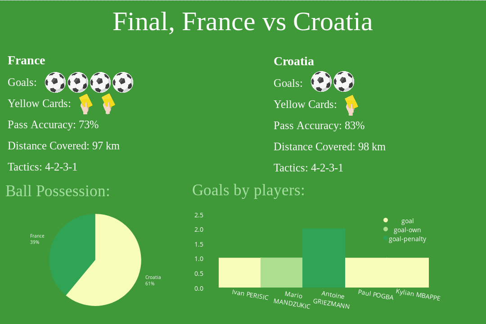

# ElastiCup 

## Analyze 2018 FIFA World Cup with the ELK stack!

This project loads automatically information about world cup games into Elastcsearch.

It sets up elasticsearch and kibana docker containers which are ready for your analysis. 

When you deploy the stack, a python script downloads the current status (updates every minute!) and loads it instently to elasticsearch!

## Getting Started

1. Make sure you have docker swarm!
2. Clone the project by running:

```git clone https://github.com/eeddaann/ElastiCup.git```

3. Build the Docker images:

   - Kibana's image:

     ``` bash
     docker build ./kibana -t kibana-canvas
     ```

     *This can take few minutes because of the installation of canvas..* 

   - ETL (extract - transforom - load) image:

     ```bash
     docker build ./etl -t elasticup-etl
     ```

4. Deploy the docker stack:

``` docker stack deploy -c docker-compose.yml elasticup``` 

5. Now open kibana on:

```http://127.0.0.1:5601``` 

6. Click on "Canvas" in the side menu 
7. Load the workpad by clicking on "workpads" button at the bottom menu
8. Drag and drop elasticup.json

## Screenshots




## data

The data is imported from: https://worldcup.sfg.io/matches

To analyze this data efficiently with Elasticsearch I decomposed the data about each match to three elasticsearch's documents. Each kind of documented is loaded into dedicated index:

### matches


## team-stats


## events

